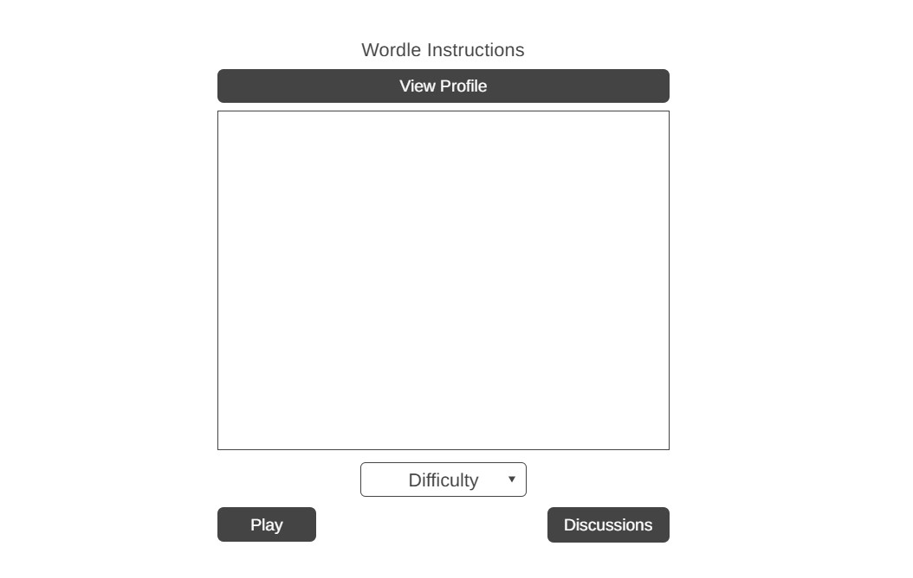
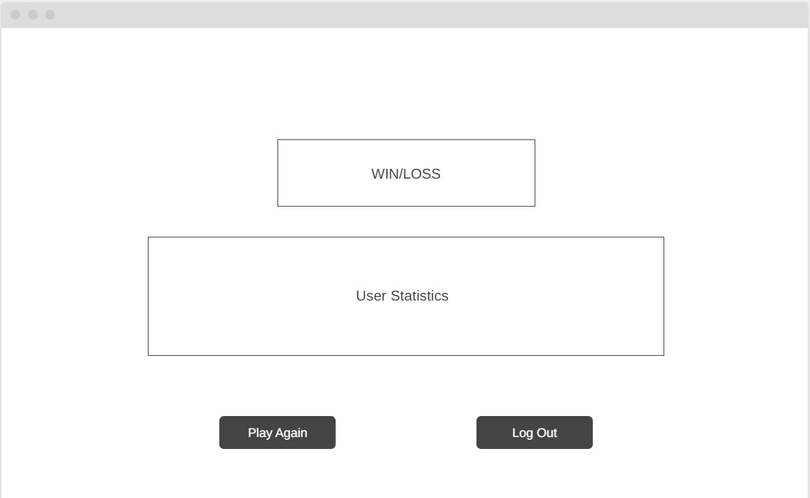

# **Wordle Game**
We made our own version of the iconic NY Times puzzle game; Wordle. We made this for the CSC207 group project.

## Names and GitHub IDs
| Contributor Name          |       ID        |
|---------------|:---------------:|
| Raghav Sinha  | raghavatruntime |
| Ibrahim Majid |     ibrmaj      |
| Geon Lim      |    1004gun1     |
| Carol Xu      |    CaaarolXu    |
| Ismail Majid  |   majidism006    |

Here’s a complete README file for your Wordle project based on the provided checklist:

---

## **Summary**

### **What This Project Does**
This project is a software implementation of a Wordle-inspired game. Players guess a hidden five-letter word in six attempts, receiving color-coded feedback on their guesses. The game is designed with multiple difficulty levels and additional features like a discussion board and user profiles.

### **Why This Project Was Made**
The purpose of this project is twofold:
1. To create an engaging and educational word game that improves vocabulary and logical reasoning.
2. To demonstrate clean architecture principles in a scalable, modular, and maintainable software project.

### **Who Will Find This Useful**
- **Casual players** seeking a fun and challenging word game.
- **Developers and students** learning clean architecture principles.

---

## **Table of Contents**

| **Section**       | **Description**                          |
|--------------------|------------------------------------------|
| [1. Features](#features)             | Overview of the application's key features.        |
| [2. Installation Instructions](#installation-instructions) | Step-by-step guide to setting up the project.     |
| [3. Usage Guide](#usage-guide)       | Instructions on how to use the application.        |
| [4. License](#license)               | Licensing details for the project.                 |
| [5. Feedback](#feedback)             | How to provide feedback or report issues.          |
| [6. Contributing](#contributing)     | Guidelines for contributing to the project.        |

---

## **Features**

### **Gameplay**
- **Word Guessing**: Guess the hidden word in six attempts.
- **Feedback**: Color-coded tiles to indicate correct/incorrect letters and positions.

### **Customization**
- **Difficulty Levels**: Choose between easy, medium, and hard difficulties.
- **User Profiles**: Save and view personalized user data.
- **Discussion Board**: Engage with other players and discuss strategies.

### **Architecture**
- **Clean Architecture**: Organized into layers for scalability and maintainability.
- **Components**:
  - **Interface Adapter Layer**: Manages controllers, presenters, and state.
  - **Use Case Layer**: Handles business logic and application rules.
  - **Entities Layer**: Core domain objects like DifficultyState and GridState.

### **Visuals**
- **Modern GUI**: A user-friendly graphical interface built with Swing.
- **Interactive Components**: Dropdown menus, buttons, and dialog windows.

---

## **Installation Instructions**

### **System Requirements**
- **Operating System**: Windows, macOS, or Linux.
- **Java Version**: JDK 17 or higher.

### Prerequisites
- IntelliJ IDEA (or any other Java IDE) is recommended.

### Steps to Install and Run

1. **Clone the Repository**:
   ```bash
   git clone https://github.com/your-username/wordle-game.git
   ```

2. **Navigate to the Project Directory**:
   ```bash
   cd wordle-game
   ```

3. **Using IntelliJ IDEA**:
    - Open IntelliJ IDEA.
    - Select **File > Open** and navigate to the `wordle-game` directory.
    - IntelliJ will detect the project structure. Ensure the `src/` folder is marked as a source directory under **File > Project Structure**.
    - Locate the main class (e.g., `view.WordleInstructionsGUI`).
    - Right-click the file and select **Run** to launch the application.

4. **Command-Line Alternative (if IntelliJ is not used)**:
    - Compile the project:
      ```bash
      javac -d bin src/**/*.java
      ```
    - Run the application:
      ```bash
      java -cp bin view.WordleInstructionsGUI
      ```

    
### **Dependencies**
- **JUnit 5** (for unit testing)
  - Install via Maven or Gradle if needed.
  
---

## **Usage Guide**

### **Starting the Game**
1. Launch the program using the installation steps above.
2. Login if you have an account, signup to create a new account.
3. Read all instructions, check your profile by clicking "View Profile" or access the discussions by clicking "discussions".
4. Set your private personal status and save on the View Profile page.
5. Select your level of difficulty from the dropdown menu
6. Press "Play" to begin.
7. Keep playing and check out your wins, losses and win-rate!
8. Have fun!

### **Additional Features**
- **View Profile**: Click the "View Profile" button to view your statistics and information.
- **Discussion Board**: Join conversations with other players by clicking the "Discussion Board" button.

### **Screenshots & Project Wireframes**
### Signup

### Login

### Instructions and Pre-game

### Player Discussion Board

### Wordle Grid

### Game End and Player Statistics

### User Profile and Status Settings

---

## **License**

Creative Commons CC0 1.0 Universal License
This project is dedicated to the public domain under the Creative Commons CC0 1.0 Universal (CC0) license.
You can copy, modify, distribute, and perform the work, even for commercial purposes, all without asking permission.

Disclaimer:
This project is provided "as-is" with no warranties of any kind. For the full legal code, see below:

<details> <summary>View Full License</summary>
plaintext
Copy code
[Insert the full Creative Commons Legal Code here]
</details>
For more details, visit the official Creative Commons License Page.

---

## **Feedback**

We value your feedback! To share your thoughts:
1. Visit [Google Feedback Form](https://forms.gle/QQhu5Jy2bMja1VQv8).
2. Fill out the form with your comments or suggestions.
3. Expect a response within 5 business days.

---

## **Contributing**

### **How to Contribute**
1. Fork the repository on GitHub.
2. Create a new branch for your feature:
   ```bash
   git checkout -b feature/your-feature
   ```
3. Submit a pull request with a detailed description of your changes.

### **Contribution Guidelines**
- Ensure your code follows clean architecture principles.
- Write unit tests for new features.
- Describe your changes clearly in the pull request.

---

### **Thank you for using Wordle Game! Enjoy guessing and learning.**


